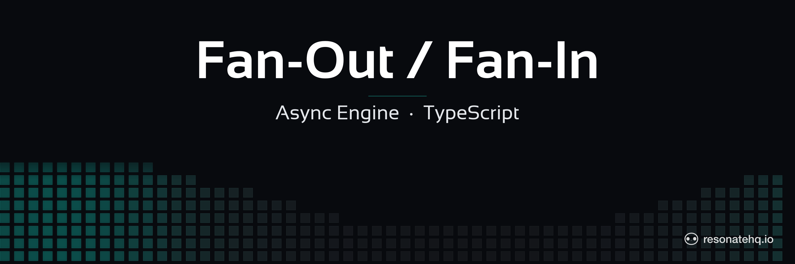

<p align="center">
  <picture>
    <source media="(prefers-color-scheme: dark)" srcset="./assets/banner-dark.png">
    <source media="(prefers-color-scheme: light)" srcset="./assets/banner-light.png">
    
  </picture>
</p>

<p align="center">
  <a href="https://resonatehq.github.io/examples-ci/">
    
  </a>
</p>

# Fan-Out / Fan-In — Async Engine

Parallel notification delivery with intra-process retry, using the async/await engine. When an order is confirmed, notify the customer simultaneously through all four channels — email, SMS, Slack, and push notification. Total time equals the slowest channel, not the sum.

## What This Demonstrates

- **Fan-out with `ctx.run()`**: each call is eager — all four channels start immediately, no `await` needed to launch them
- **Fan-in with `Promise.all()`**: native JavaScript promise composition, no special parallel mode
- **Per-step retry opt-in**: the async engine defaults to `Never` retry; `ctx.options({ retryPolicy: new Exponential() })` opts a single step in
- **Checkpoint independence**: if push retries, email/SMS/Slack are already checkpointed and are not re-sent

## The Key Difference from the Generator Engine

The async engine's `ctx.run()` returns a `DurablePromise<T>` immediately — the step starts executing in the background. This makes fan-out natural:

```typescript
// Async engine — fan-out: all four start at the same time
const emailP = ctx.run(sendEmail, event);
const smsP   = ctx.run(sendSms, event);
const slackP = ctx.run(sendSlack, event);
const pushP  = ctx.run(sendPush, event, failOnce);

// Fan-in: native Promise.all — waits for all four
const results = await Promise.all([emailP, smsP, slackP, pushP]);
```

Compare to the [generator engine sibling](https://github.com/resonatehq-examples/example-fan-out-fan-in-ts), which uses `yield* ctx.beginRun()` and explicit future handles.

**Retry policy note**: the async engine defaults to `Never` retry — you opt in per step:

```typescript
// Default: Never retry (fails immediately on error)
const smsP = ctx.run(sendSms, event);

// Opt in to Exponential for one step only
const pushP = ctx.run(sendPush, event, failOnce, ctx.options({ retryPolicy: new Exponential() }));
```

This differs from the generator engine: `ctx.beginRun()` with a regular async function defaults to `Exponential` retry; with a generator function it defaults to `Never`. The async engine always starts at `Never` — opt in explicitly per step.

## Prerequisites

- [Bun](https://bun.sh) v1.0+

No server required. The async engine runs in embedded mode when `RESONATE_URL` is not set.

## Setup

```bash
git clone https://github.com/resonatehq-examples/example-fan-out-fan-in-async-ts
cd example-fan-out-fan-in-async-ts
bun install
```

## Run It

**Happy path** — all 4 channels in parallel:
```bash
bun start
```

```
=== Fan-Out / Fan-In (Async Engine) ===
Mode: HAPPY PATH  (4 channels, Promise.all fan-in)

Order ord_1784579565239 confirmed — notifying user_alice...

  [email]   Sending confirmation to user_alice...
  [sms]     Sending SMS to user_alice...
  [slack]   Posting to #orders...
  [push]    Sending push to user_alice (attempt 1)...
  [push]    Delivered — msg_push_dm1xgs
  [slack]   Posted — msg_slack_3g1seo
  [sms]     Sent — msg_sms_asztqd
  [email]   Sent — msg_email_aj5eu3

=== Result ===
Channels notified: 4/4
Wall time: 412ms

Channel timings:
  email  402ms  msg_email_aj5eu3
  sms    251ms  msg_sms_asztqd
  slack  181ms  msg_slack_3g1seo
  push   121ms  msg_push_dm1xgs

Fan-out time:   412ms
Sequential est: 955ms
Speedup:        2.3x
```

**Retry mode** — push service down on attempt 1; opted into `Exponential` retry, so it recovers:
```bash
bun start:retry
```

```
=== Fan-Out / Fan-In (Async Engine) ===
Mode: RETRY DEMO  (push fails on attempt 1 → retries with Exponential)

Order ord_1784579575850 confirmed — notifying user_alice...

  [email]   Sending confirmation to user_alice...
  [sms]     Sending SMS to user_alice...
  [slack]   Posting to #orders...
  [push]    Sending push to user_alice (attempt 1)...
  [slack]   Posted — msg_slack_mmri73
  [sms]     Sent — msg_sms_7p9qga
  [email]   Sent — msg_email_ui84zk
  [push]    Sending push to user_alice (attempt 2)...
  [push]    Delivered — msg_push_9clbxu

=== Result ===
Channels notified: 4/4
Wall time: 2252ms
```

> **Wall time**: `Exponential`'s default initial delay is 1s, so the first retry fires after ~2s (1000ms × 2¹). Pass `new Exponential({ delay: 100 })` to speed up the demo.
>
> **Durability note**: in embedded mode (`RESONATE_URL` unset), checkpoints live in process memory — a real process crash loses them. For persistent crash recovery, connect to a Resonate server via `RESONATE_URL`.

**With a Resonate server** (optional):
```bash
RESONATE_URL=http://localhost:8073 bun start
```

## What to Observe

1. **Parallel start**: all four `[channel]   Sending...` lines appear before any completion lines — they start concurrently without waiting for each other.
2. **Completion order**: channels finish in latency order (push 120ms, slack 180ms, sms 250ms, email 400ms), not submission order.
3. **Speedup**: ~412ms total vs ~955ms sequential — bounded by the slowest channel, not the sum.
4. **Partial retry**: in retry mode, email/SMS/Slack complete and checkpoint while push is still failing. Push retries on its own. The other three are NOT re-sent.

## The Code

The workflow is in [`src/workflow.ts`](src/workflow.ts):

```typescript
import type { Context } from "@resonatehq/sdk/async";
import { Exponential } from "@resonatehq/sdk";

export async function notifyAll(
  ctx: Context,
  event: OrderEvent,
  failOnce: boolean,
): Promise<NotificationSummary> {
  const start = Date.now();

  // Fan-out: ctx.run() is eager — all four start immediately
  const emailP = ctx.run(sendEmail, event);
  const smsP   = ctx.run(sendSms, event);
  const slackP = ctx.run(sendSlack, event);

  // Push: opt into retry only for this step
  const pushP = failOnce
    ? ctx.run(sendPush, event, failOnce, ctx.options({ retryPolicy: new Exponential() }))
    : ctx.run(sendPush, event, failOnce);

  // Fan-in: native Promise.all — DurablePromise<T> implements Promise<T>
  const results = await Promise.all([emailP, smsP, slackP, pushP]);

  return {
    orderId: event.orderId,
    channelsNotified: results.filter((r) => r.success).length,
    totalMs: Date.now() - start,
    results,
  };
}
```

## File Structure

```
example-fan-out-fan-in-async-ts/
├── src/
│   ├── index.ts      Entry point — Resonate setup and demo runner
│   ├── workflow.ts   Fan-out / fan-in workflow using async engine
│   └── channels.ts   Channel functions — email, SMS, Slack, push
├── assets/
│   ├── banner-dark.png
│   └── banner-light.png
├── package.json
└── tsconfig.json
```

## Learn More

- [Resonate documentation](https://docs.resonatehq.io)
- [Generator engine sibling](https://github.com/resonatehq-examples/example-fan-out-fan-in-ts) — same pattern with `function*`/`yield*`/`beginRun`
